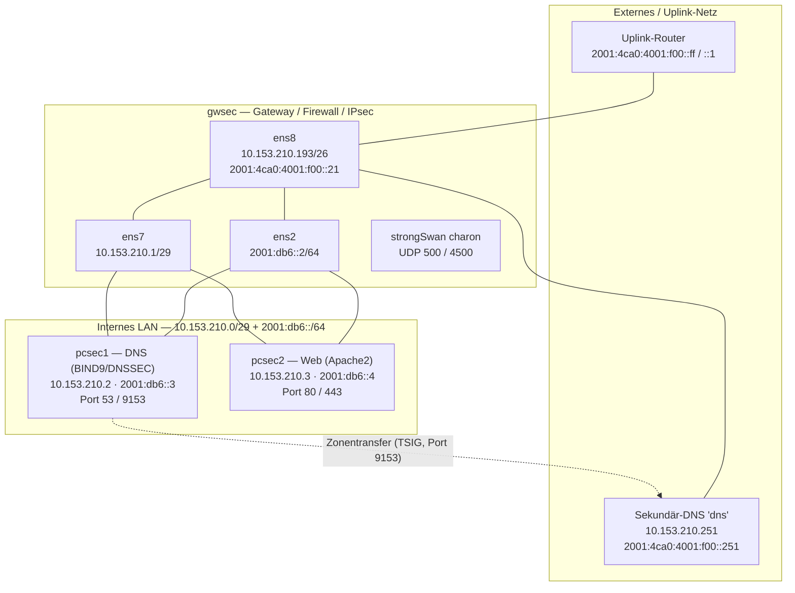

# Netzwerk- & Systemarchitektur — Gruppe 09 (SecP Lab)

> Stand: 2026-07-13 · erstellt durch Live-Analyse via SSH (`gwsec`, `pcsec1`, `pcsec2`)

Dieses Dokument beschreibt, aus welchen Systemen die Laborumgebung besteht,
welche IP-Adressen sie tragen, welche Dienste sie anbieten und wie sie
miteinander verbunden sind.

---

## 1. Zugang / SSH-Sprungpunkte

Alle drei VMs hängen hinter **einem** öffentlichen Hostnamen und sind über
unterschiedliche Ports per Port-Forwarding erreichbar (jeweils als `root`):

| Host   | Öffentlicher Zugang                         | Port | User |
| ------ | ------------------------------------------- | ---- | ---- |
| gwsec  | `gruppe09.secp.lab.nm.ifi.lmu.de`           | 9001 | root |
| pcsec1 | `gruppe09.secp.lab.nm.ifi.lmu.de`           | 9002 | root |
| pcsec2 | `gruppe09.secp.lab.nm.ifi.lmu.de`           | 9003 | root |

Definiert in der lokalen `~/.ssh/config`:

```sshconfig
Host gwsec
    HostName gruppe09.secp.lab.nm.ifi.lmu.de
    Port 9001
    User root

Host pcsec1
    HostName gruppe09.secp.lab.nm.ifi.lmu.de
    Port 9002
    User root

Host pcsec2
    HostName gruppe09.secp.lab.nm.ifi.lmu.de
    Port 9003
    User root
```

---

## 2. Überblick der Rollen

| System     | Rolle                                        | Kernsoftware                     |
| ---------- | -------------------------------------------- | -------------------------------- |
| **gwsec**  | Gateway / Router / Firewall / IPsec-VPN-Peer | strongSwan (charon), iptables/NAT |
| **pcsec1** | Interner autoritativer DNS-Server (DNSSEC)   | BIND9 (`named`)                  |
| **pcsec2** | Interner Web-Server                          | Apache2 (HTTP/HTTPS)             |

`gwsec` ist die zentrale Drehscheibe: Es routet zwischen dem internen LAN
(pcsec1/pcsec2) und dem Uplink/externen Netz und terminiert IPsec.

---

## 3. Netze im Detail

### IPv4

| Netz                | Rolle                     | Interface (gwsec) | Belegte Adressen                                   |
| ------------------- | ------------------------- | ----------------- | -------------------------------------------------- |
| `10.153.210.0/29`   | Internes LAN              | `ens7` → `.1`     | `.1` gwsec · `.2` pcsec1 · `.3` pcsec2             |
| `10.153.210.192/26` | Externes/Uplink-Netz      | `ens8` → `.193`   | `.193` gwsec · `.251` externer Sekundär-DNS (`dns`) |

### IPv6

| Netz                       | Rolle                        | Belegte Adressen                                              |
| -------------------------- | ---------------------------- | ------------------------------------------------------------ |
| `2001:db6::/64`            | Internes IPv6-LAN (ens2)     | `::2` gwsec · `::3` pcsec1 · `::4` pcsec2 · `::ff` Router     |
| `2001:4ca0:4001:f00::/64`  | Externes IPv6-Netz (ens8)    | `::21` gwsec · `::251` `dns` · `::ff` / `::1` Uplink-Router   |
| `2001:4ca0:4001:f21::/64`  | Öffentliches Service-IPv6 (laut DNS) | `::2` pcsec1 · `::3` pcsec2                          |

> Hinweis: Die Maschinen tragen auf `ens2` intern `2001:db6::x`, während der
> DNS für die nach außen sichtbaren Dienste `2001:4ca0:4001:f21::x` publiziert.

---

## 4. System-Steckbriefe

### 4.1 gwsec — Gateway / Firewall / IPsec

| Interface | Adresse(n)                                             | Zweck                       |
| --------- | ------------------------------------------------------ | --------------------------- |
| `ens2`    | `2001:db6::2/64`                                        | Internes IPv6-LAN           |
| `ens7`    | `10.153.210.1/29`                                       | Internes IPv4-LAN (Gateway) |
| `ens8`    | `10.153.210.193/26`, `2001:4ca0:4001:f00::21/64`        | Externer Uplink             |

- **Routing:** IPv4- und IPv6-Forwarding aktiv (`net.ipv4.ip_forward=1`,
  `net.ipv6.conf.all.forwarding=1`) → arbeitet als Router.
- **NAT:** `iptables -t nat` POSTROUTING `MASQUERADE` (Regel auf `ens3`
  hinterlegt — Legacy-Interface, aktuell nicht vorhanden).
- **Firewall:** Filter-Chains INPUT/FORWARD/OUTPUT stehen auf Policy `ACCEPT`
  (keine restriktiven Regeln aktiv).
- **IPsec:** strongSwan 5.5.1 (`charon`) lauscht auf UDP `500` (IKE) und
  `4500` (NAT-T). Konfiguration in `/etc/swanctl/`; aktuell **0 aktive
  Security Associations**.
- **Default-Route (IPv6):** via `2001:4ca0:4001:f00::ff` bzw. `::1`
  (Uplink-Router).
- **Dienste:** `sshd` (22), `charon` (500/4500).

### 4.2 pcsec1 — DNS-Server (BIND9 / DNSSEC)

| Interface | Adresse(n)          | Zweck             |
| --------- | ------------------- | ----------------- |
| `ens2`    | `2001:db6::3/64`    | Internes IPv6-LAN |
| `ens7`    | `10.153.210.2/29`   | Internes IPv4-LAN |

- **Default-Gateway:** `10.153.210.1` (gwsec) für IPv4, `2001:db6::2` (gwsec)
  für IPv6.
- **Dienst:** `named` (BIND9) — lauscht auf Port `53` (`10.153.210.2`,
  `2001:db6::3`, localhost), zusätzlich Port `9153` (Zonentransfer/Notify),
  `rndc` auf `953` (localhost).
- **Autoritative Zonen:**
  - Forward: `sub09.gruppe09.secp-int.lab.nm.ifi.lmu.de` — **DNSSEC-signiert**
    (`*.signed`, Schlüssel `Ksub09...+008+33285`, `+008+51430`).
  - Reverse (IPv6): `1.2.f.0.1.0.0.4.0.a.c.4.1.0.0.2.ip6.arpa`
    (= `2001:4ca0:4001:f21::/64`).
- **Zonentransfer:** abgesichert per TSIG-Key `sub09-transfer.`; `also-notify`
  an `10.153.210.251` (externer Sekundär-DNS `dns`) auf Port `9153`.
- **Recursion:** `no` (reiner autoritativer Server), `allow-query { any; }`.

**Wichtige DNS-Records (Forward-Zone):**

| Name     | A (IPv4)          | AAAA (IPv6)             |
| -------- | ----------------- | ----------------------- |
| pcsec1   | `10.153.210.2`    | `2001:4ca0:4001:f21::2` |
| pcsec2   | `10.153.210.3`    | `2001:4ca0:4001:f21::3` |
| gwsec    | `10.153.210.193`  | `2001:4ca0:4001:f00::21`|
| dns      | `10.153.210.251`  | `2001:4ca0:4001:f00::251`|

### 4.3 pcsec2 — Web-Server (Apache2)

| Interface | Adresse(n)          | Zweck             |
| --------- | ------------------- | ----------------- |
| `ens2`    | `2001:db6::4/64`    | Internes IPv6-LAN |
| `ens7`    | `10.153.210.3/29`   | Internes IPv4-LAN |

- **Routing:** Keine IPv4-Default-Route (nur direktes `/29`-LAN); IPv6 über
  Router `2001:db6::ff` erreichbar.
- **Dienst:** `apache2` auf Port `80` (HTTP) und `443` (HTTPS).
  - vHost `443`: `ServerName gruppe09.secp.lab.nm.ifi.lmu.de`,
    `DocumentRoot /var/www/html`.
  - TLS: `/etc/ssl/secp/apache2.pem` (+ `.key`, Chain `cacert.pem`).

---

## 5. Externe / vorgelagerte Komponenten

| Komponente          | Adresse(n)                                    | Rolle                                    |
| ------------------- | --------------------------------------------- | ---------------------------------------- |
| Sekundär-DNS `dns`  | `10.153.210.251` / `2001:4ca0:4001:f00::251`  | Empfängt Zonentransfers von pcsec1       |
| Uplink-Router       | `2001:4ca0:4001:f00::ff` / `::1`              | IPv6-Default-Gateway für gwsec           |

---

## 6. Verbindungs-Diagramm



## 7. Erreichbarkeit — Kurzreferenz

| Von \ Zu   | gwsec                       | pcsec1                    | pcsec2                    |
| ---------- | --------------------------- | ------------------------- | ------------------------- |
| Admin (SSH)| Port 9001                   | Port 9002                 | Port 9003                 |
| Intern IPv4| `10.153.210.1`              | `10.153.210.2`            | `10.153.210.3`            |
| Intern IPv6| `2001:db6::2`               | `2001:db6::3`             | `2001:db6::4`             |
| Extern IPv4| `10.153.210.193`            | — (via gwsec NAT)         | — (via gwsec NAT)         |
| Dienste    | IKE/IPsec 500,4500          | DNS 53/9153               | HTTP 80 / HTTPS 443       |

---

### Zusammengefasst

- **gwsec** = Tür zur Außenwelt: Router + Firewall + IPsec-Endpunkt, hängt mit
  drei Interfaces zwischen internem LAN (`ens7`/`ens2`) und Uplink (`ens8`).
- **pcsec1** = interner DNSSEC-DNS-Server, autoritativ für
  `sub09.gruppe09.secp-int...`, transferiert Zonen abgesichert per TSIG an den
  externen Sekundär-DNS `dns` (`10.153.210.251`).
- **pcsec2** = interner Apache-Web-Server (HTTP/HTTPS mit SecP-Zertifikat).
- pcsec1/pcsec2 nutzen **gwsec** als Gateway; nach außen sind sie nur über
  gwsec (Routing/NAT/DNS) sichtbar.
